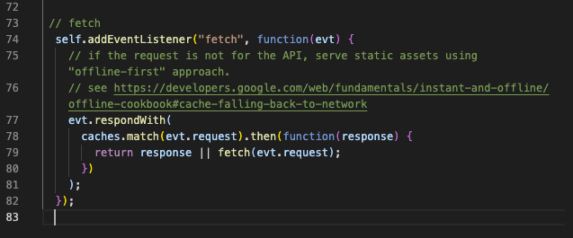
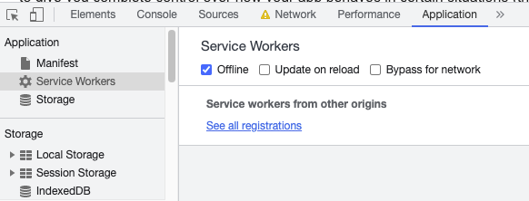

# budgetOnTheGo 

The client wanted a simple financial tracker that can be updated while the user is offline. This is very helpful for users on the go. 

## User Story
AS AN avid traveller
I WANT to be able to track my withdrawals and deposits with or without a data/internet connection
SO THAT my account balance is accurate when I am traveling

## Business Context

Giving users a fast and easy way to track their money is important, but allowing them to access that information anytime is even more important. Having offline functionality is paramount to our applications success.

## Built With

- [HTML](https://developer.mozilla.org/en-US/docs/Web/HTML)
- [CSS](https://developer.mozilla.org/en-US/docs/Web/CSS)
- [Javascript](https://developer.mozilla.org/en-US/docs/Web/JavaScript)
- [Express](https://expressjs.com/)
- [MongoDB](https://www.mongodb.com/)
- [Service-Worker](https://developer.mozilla.org/en-US/docs/Web/API/Service_Worker_API)

## Instructions

* Open and study the existing contents, specifically in the `package.json` file at the root of the application. 

* Install dependencies by running `npm install` at the project root. 

* Start the app by running `npm start` from the project root.

* Once the app starts open your browser to [localhost:3000](http://localhost:3000).

* Open the inspect tools on your browser. Navigate to application and open the server worker tab. You can check the functionality of the app by clicking offline, entering information, and then clicking offline again, then refresh the browser. 

## Deployed Link

- [See Live Site](https://github.com/JessGiannini/budgetOnTheGo)

## Authors

**Jessica Giannini**

* [Link to Portfolio Site](https://github.com/JessGiannini/New-Web-Developer-Portfolio)
* [Link to Github](https://github.com/jessgiannini)
* [Link to LinkedIn](https://www.linkedin.com/in/jessica-giannini-155b1310/)

## Acknowledgments

- Thank you to my amazing classmates who help me navigate the ins and outs of coding.
- Thanks to all the YouTube stars who helped me see the many ways to pet a cat.
- Thanks to my friend Kelsey for inspiring me to take this course.
